# Part 2

## 0 Foreword

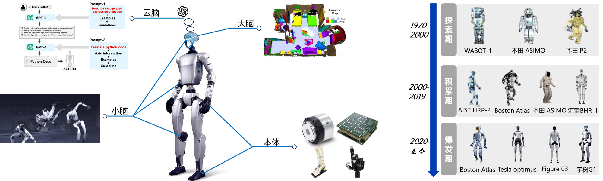

​ This part systematically introduces the basic knowledge and core principles of the Vision-Language-Action Model (VLA), reinforcement learning (RL), and imitation learning in humanoid robots. Imitation learning provides a fast path for robots to acquire basic behaviors by learning from human demonstrations; reinforcement learning, centered on the PPO algorithm, enables robots to optimize behaviors through environmental interaction, with its theoretical system starting from Markov Decision Process, passing through Bellman Equation and Policy Gradient Method, and finally converging to PPO. The VLA model, taking OpenVLA as the core, realizes the integration of "perception-understanding-execution" and has been iteratively improved through methods such as flow matching, π₀.₅, and dual-system architecture. The part elaborates on the core principles of the three technologies, combines practical operation cases of reinforcement learning, and summarizes key mathematical formulas, providing college students with a systematic theoretical foundation and practical reference oriented to humanoid robot applications.

## 1. Introduction

​ As a frontier intersection of artificial intelligence and robotics technology, humanoid robots are undergoing a major transformation from pre-programmed execution to intelligent autonomous decision-making. This transformation is jointly driven by three core technologies: reinforcement learning (RL), imitation learning, and the Vision-Language-Action (VLA) model. Among them, reinforcement learning, rooted in the Markov Decision Process, provides robots with powerful autonomous learning capabilities through continuous interaction with the environment, enabling them to optimize behavioral strategies via a trial-and-error mechanism—an indispensable technology for high-dynamic motion control, as exemplified by Boston Dynamics’ Atlas and Unitree robots mastering balance control and complex movements. Imitation learning, as a complementary technology, allows robots to quickly acquire basic action skills by learning from human demonstrations, reducing the difficulty of initial training and laying a solid foundation for subsequent reinforcement learning optimization. Together, these two technologies address the basic action learning needs of humanoid robots, while the VLA model further breaks the bottleneck of "perception-understanding-execution" separation.

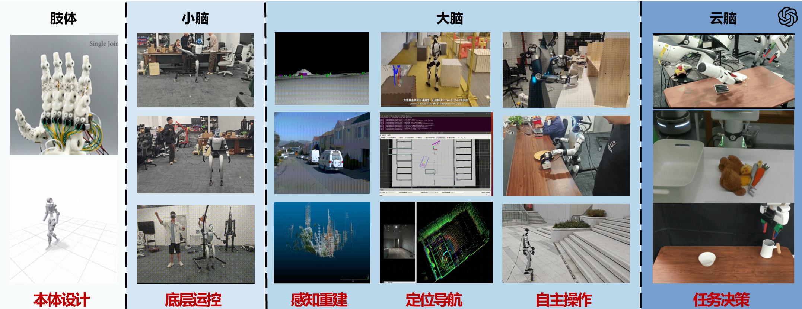

​ However, relying solely on reinforcement learning and imitation learning still faces limitations in human-centric scenarios: traditional robot control systems adopt a modular serial architecture, which is prone to error accumulation and poor generalization. Meanwhile, traditional Vision-Language Models (VLMs) can bridge the gap between perception and language but fail to generate executable actions, resulting in a disconnect between "knowledge" and "action." To solve this problem, the Vision-Language-Action (VLA) model emerges as an end-to-end multimodal framework, unifying visual perception, language understanding, and action generation into a single system. Taking OpenVLA as the core, the VLA model has undergone continuous iterative improvements (such as RT-2, π₀.₅, and Helix architectures), further enhancing the adaptability and execution efficiency of humanoid robots. This part systematically elaborates on the basic principles, core algorithms, and practical applications of imitation learning, reinforcement learning (focusing on PPO), and VLA models, providing a comprehensive theoretical and practical reference for the intelligent control of humanoid robots.


## 2. Basic Knowledge of Imitation Learning

​ Imitation learning (IL) is a key auxiliary technology for humanoid robot behavior learning, which enables robots to acquire action skills by imitating human demonstrations, avoiding the inefficiency of pure reinforcement learning in the initial training stage. Its core idea is to learn a policy that can replicate expert (human) behaviors from an expert demonstration dataset, which is particularly suitable for the initial training of humanoid robots for relatively complex tasks such as dancing, martial arts, and other similar movements.

​ The most widely used method in imitation learning for humanoid robots is Behavior Cloning (BC), which directly maps the observed state (e.g., visual input, joint angles) to the expert’s action through a neural network. The training objective of BC is to minimize the loss between the robot’s predicted action and the expert’s demonstration action, and its mathematical expression is:

$$
L_{BC} = \mathbb{E}_{(s,a) \sim \mathcal{D}} \left\| \pi_\theta(s) - a_{\text{expert}} \right\|^2
$$

Where:

- $\mathcal{D}$ : Expert demonstration dataset, including the state  $s$  (joint angles,) and the corresponding expert action  $a_{\text{expert}}$  (joint torque, end-effector position);

- $\pi_\theta(s)$ : Deterministic policy network to be trained, parameterized by  $\theta$ , outputting the robot’s predicted action vector under state  $s$ ;

- $\left| \cdot \right|^2$ : L2 norm, measuring the difference between the predicted action and the expert action.

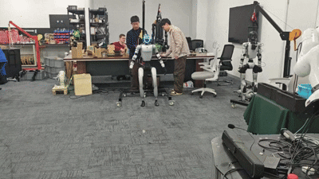

## 3. Basic Knowledge of Reinforcement Learning (Focus on PPO)

### 3.1 Core Foundation of PPO: MDP, Value Function and Basic RL Logic

​ For humanoid robots, all dynamic control tasks of PPO training can be abstracted as a **continuous-state, continuous-action Markov Decision Process (MDP)**, which provides a standardized interaction framework for the robot and the environment, laying the foundation for PPO policy optimization.

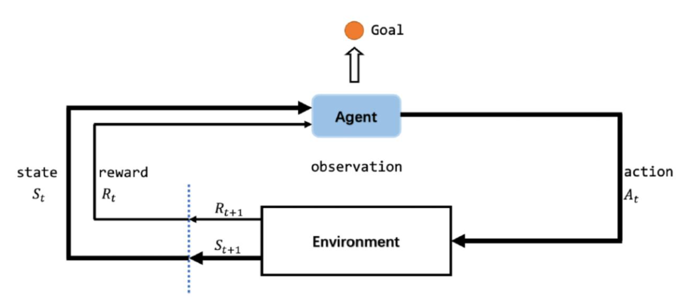

The continuous MDP for PPO training of humanoid robots consists of 6 core elements (directly related to PPO training effect):

1. **State Space** $\mathcal{S}$ : The set of all possible states of the humanoid robot, including continuous physical quantities such as whole-body joint angles, root position, root orientation, joint velocity, and center of mass position. Incorrect definition of state space will lead to PPO failing to capture key motion information, resulting in unstable training.

2. **Action Space A**: The set of all executable actions of the robot, mainly continuous control commands such as joint torque, end-effector position, and movement speed (e.g., the torque range of each leg joint of the robot is [-10, 10]N·m). PPO is designed for continuous action space, which perfectly matches the control needs of humanoid robots.

3. **Transition Probability** $P(s'|s,a)$ : The probability that the robot transitions from the current state $s$  to the next state  $s'$  after executing action  $a$  (e.g., the probability of maintaining balance after adjusting the knee joint torque). It affects the PPO’s prediction of future state value and further influences policy update stability.

4. **Reward Function** $R(s,a,s')$ : The core guidance for PPO training, which quantitatively evaluates the action  $a$  taken by the robot in state  $s$ . Reasonable reward design (e.g., positive reward for stable standing and forward walking, negative reward for falling and joint over-limit) is the key to PPO converging to the target behavior; unreasonable design will lead to policy divergence.

5. **Discount Factor** $\gamma \in [0,1]$ : Balances the robot's attention to immediate rewards and long-term task goals (e.g., completing a full walking cycle to obtain a higher cumulative reward). A value too close to 1 will make PPO focus too much on long-term rewards and slow down convergence; a value too small will lead to short-sighted behavior (e.g., only pursuing immediate balance and failing to complete walking tasks).

6. **Policy** $\pi$ : A mapping from state  $s \in \mathcal{S}$  to action  $a \in \mathcal{A}$ , determining the robot’s action in a given state. PPO adopts a stochastic policy  $\pi_\theta(a|s)$  (probability distribution of actions), which enhances the robot’s environmental exploration ability and avoids falling into local optimal solutions.

7. **Trajectory and Cumulative Return**: $\tau = (s_0,a_0,R_1,s_1,...,s_T)$ is the interaction trajectory of the robot and the environment; $G_t = \sum_{k=t}^{T-1}\gamma^{k-t}R_{k+1}$ is the cumulative discounted return starting from time step $t$, a key indicator for policy optimization.

​ The core interaction cycle of PPO training (robot-agent & environment) is:

$$
\begin{aligned}
&\text{Observe state } S_t \\
\rightarrow &\text{Select action } A_t \text{ by PPO policy} \\
\rightarrow &\text{Transition to } S_{t+1} \\
\rightarrow &\text{Obtain reward } R_{t+1} \\
\rightarrow &\text{Update PPO policy}
\end{aligned}
$$


​ The core logic of PPO is to continuously optimize the policy  $\pi_\theta$  through this cycle, maximizing the robot’s expected cumulative discounted reward.

#### 3.1.1 Value Function and Bellman Equation (Core for PPO Update)

​ Bellman Equation provides the core rule for the robot to "predict the future收益 of actions" in PPO training, and the value function quantifies the "goodness" of states and actions, which is the basis for PPO policy update.

​ Two core value functions in PPO training (only focus on practical effects in PPO):

1. **State Value Function** $V^\pi(s)$ : The expected cumulative reward obtained by the robot following the PPO policy  $\pi$  starting from state  $s$ . In PPO, it is used to evaluate the overall value of the current state, helping the robot judge whether the current motion state is beneficial to the long-term task (e.g., the expected cumulative reward of the robot in a stable standing state is higher than that in an unstable state).

The core logic of V value update in PPO is

$$
V^{\pi }(s)=\mathbb {E}_{\pi }\left[ R_{t+1}+\gamma V^{\pi }(S_{t+1}) | S_{t}=s\right]
$$

1. **Action Value Function** $Q^\pi(s,a)$ : The expected cumulative reward obtained by the robot taking action  $a$  in state  $s$  and then following the PPO policy  $\pi$ . In PPO, it directly reflects the quality of a specific action (e.g., adjusting the knee joint torque by a specific value in the standing state), and its update relies on Temporal Difference (TD) learning—the core rule is to update the Q value based on the immediate reward and the predicted value of the next state, ensuring that the robot can continuously learn the optimal action.

The core logic of Q value update in PPO (TD learning) is:  

$$
Q(s_t,a_t) \leftarrow Q(s_t,a_t) + \alpha [R_{t+1} + \gamma V(s_{t+1}) - Q(s_t,a_t)]
$$

  where TD target=$R_{t+1} + \gamma V(s_{t+1})  $,  $\alpha$  is the learning rate, balancing the update speed and stability.

 The state value function and action value function can be converted to each other through the following core equations, which further reflect their recursive relationship:

$$
V^\pi(s) = \mathbb{E}_{\pi(a|s)} \left[ Q^\pi(s,a) \mid S_t = s \right]
$$

$$
Q^\pi(s,a) = \mathbb{E}_{P(s'|s,a)} \left[ R(s,a,s') + \gamma V^\pi(s') \mid S_t = s, A_t = a \right]
$$

 The first equation shows that the state value is the expected value of the action value under the current policy; the second equation combines the transition probability and discount factor, linking the action value to the immediate reward and the next state value.

#### 3.1.2 Actor-Critic Framework (PPO Core Architecture)

​ PPO adopts the Actor-Critic framework, which is equivalent to a "athlete + real-time referee" division of labor system, ensuring the stability and efficiency of PPO training for humanoid robots. The two components’ specific division of labor and cooperation in PPO are as follows:

- **Actor (Policy Network)**: Parameter  $\theta$ , outputs the stochastic policy  $\pi_\theta(a|s)$ , which is responsible for selecting actions in the current state (e.g., determining the torque of each joint when the robot is walking). It is updated via gradient ascent to maximize the expected cumulative reward

  $$
  J(\theta) = \mathbb{E}_{\tau \sim \pi_\theta} \left[ \sum_{t=0}^{T-1} \gamma^t R_{t+1} \right]
  $$

  where $\tau = (s_0,a_0,R_1,s_1,...,s_T)$ is the interaction trajectory of the robot and the environment, and the trajectory distribution is
  
  $$
  P(\tau|\theta) = P(s_0)\prod_{t=0}^{T-1} \pi_\theta(a_t|s_t) P(s_{t+1}|s_t,a_t)
  $$
  ​
We calculate the gradient of $J(\theta)$ with respect to $\theta$ via the **score function trick** $\nabla_\theta P(\tau|\theta) = P(\tau|\theta) \nabla_\theta \log P(\tau|\theta)$, and the derivation is as follows:

$$\begin{aligned}
\nabla_\theta J(\theta) &= \nabla_\theta \int P(\tau|\theta) \cdot G_0 \, d\tau \quad (G_0  = \sum_{t=0}^{T-1}\gamma^t R_{t+1}, \text{total trajectory return}) \\
&= \int P(\tau|\theta) \cdot \nabla_\theta \log P(\tau|\theta) \cdot G_0 \, d\tau \\
&= \mathbb{E}_{\tau\sim\pi_\theta} \left[ \left( \sum_{t=0}^{T-1} \nabla_\theta     \log\pi_\theta(a_t|s_t) \right) \cdot G_0 \right] \quad (\text{non-}\theta\text{ terms  have 0 gradient}) \\
&= \mathbb{E}_{\tau\sim\pi_\theta} \left[ \sum_{t=0}^{T-1} \nabla_\theta \log\pi_\theta (a_t|s_t) \cdot G_t \right] \quad (G_t = \sum_{k=t}^{T-1}\gamma^{k-t}R_{k+1})
\end{aligned}$$

  ​       We finally get the **Policy Gradient Theorem**, the core formula for policy optimization:

  $$
  \nabla_\theta J(\theta) = \mathbb{E}_{\tau\sim\pi_\theta} \left[ \sum_{t=0}^{T-1} \nabla_\theta \log\pi_\theta(a_t|s_t) \cdot G_t \right]
  $$
  ​       We update the policy parameter $\theta$ via gradient ascent to maximize $J(\theta)$.

- **Critic (Value Network)**: Parameter $w$, outputs the state value function $V(s;w)$, which acts as a "referee" to evaluate the quality of the actions selected by the Actor. It is updated via gradient descent to minimize the TD error, with its loss function: $L^{VF}(w) = \mathbb{E}_t\left[ \left( V(s_t;w) - R_t \right)^2 \right]$ (where $R_t$ is the cumulative discounted return), providing accurate value estimation for the Actor’s policy update.

​ To further improve the stability of PPO training and avoid high variance in gradient estimation, PPO introduces the **Advantage Function** $A^\pi(s_t,a_t) = Q^\pi(s_t,a_t) - V^\pi(s_t)$ , which can be understood as the "net score of action"—it measures how much better the action  $a_t$  is than the average level of all actions in state  $s_t$ . In PPO, the Advantage Function replaces the $G_t = \sum_{k=t}^{T-1}\gamma^{k-t}R_{k+1}$ to update the Actor

$$
\nabla_\theta J(\theta) = \mathbb{E}_{\tau\sim\pi_\theta} \left[ \sum_{t=0}^{T-1} \nabla_\theta \log\pi_\theta(a_t|s_t) \cdot A^\pi(s_t,a_t)  \right]
$$

effectively reducing gradient variance and avoiding joint control oscillation or robot falling caused by unstable updates.

#### 3.1.3 Importance Sampling (Key for PPO Sample Efficiency)

​ Importance sampling is a core technology to improve the sample efficiency of PPO, which is crucial for reducing the training cost of high-dimensional humanoid robots. Its core role in PPO is to realize the reuse of a single batch of sampled data, avoiding the waste of interaction data.

​ In PPO, importance sampling is embodied by the **probability ratio**

$$
r_t(\theta) = \frac{\pi_\theta(A_t|S_t)}{\pi_{\theta_{\text{old}}}(A_t|S_t)}
$$

where:

- $\pi_{\theta_{\text{old}}}$ : The old policy before update, used to sample trajectory data;

- $\pi_\theta$ : The new policy to be updated.

​ This ratio reflects the difference between the new and old policies in selecting the action  $A_t$  under state $S_t$ . In PPO, it is embedded in the objective function to ensure that the new policy can be updated using the data sampled by the old policy, realizing multiple updates of a single batch of data and greatly improving sample efficiency—this is particularly important for humanoid robots, which require a huge amount of interaction data for training.

### 3.2 PPO Algorithm Full Details (Humanoid Robot Exclusive)

#### 3.2.1 Core Essence of PPO

​ PPO (Proximal Policy Optimization) is an industrial standard policy optimization algorithm for humanoid robot control, whose core essence is to add a "two-way safety lock" to the policy update process. It solves the core pain points of humanoid robot training: avoiding policy collapse (abnormal actions leading to falling), ensuring stable joint control, and reducing training cost, which makes it the de facto standard algorithm for humanoid robot reinforcement learning.

#### 3.2.2 Core Objective Function (Clip Version, Industrial Standard)

​ The core of PPO is its Clip objective function, which realizes the "safety lock" of policy update by limiting the update amplitude of the policy. Its physical meaning is to ensure that the new policy does not deviate too much from the old policy, avoiding excessive updates leading to training instability. The mathematical expression is:

$$
L^{CLIP}(\theta) = \mathbb{E}_t\left[\min\left(r_t(\theta) A_t,\ \text{clip}(r_t(\theta), 1-\epsilon, 1+\epsilon) A_t\right)\right]
$$

Where each parameter’s meaning and influence on humanoid robot training are as follows:

- $r_t(\theta) = \frac{\pi_\theta(A_t|S_t)}{\pi_{\theta_{\text{old}}}(A_t|S_t)}$ : Probability ratio of the new and old policies, as introduced in importance sampling, which is the key to sample reuse;

- $A_t$ : Advantage Function. In engineering implementation for humanoid robots, **GAE (Generalized Advantage Estimation)** is used to calculate  $A_t$ . GAE balances bias and variance through multi-step TD learning, making the advantage estimation more stable, avoiding joint control oscillation, and ensuring the robot’s motion smoothness;

- $\epsilon$ : Clipping parameter, usually set to 0.2 (industrial empirical value), which limits  $r_t(\theta)$  to the interval  $[1-\epsilon, 1+\epsilon]$ . The influence of  $\epsilon$  on training: if  $\epsilon$  is too large, the policy update amplitude is not constrained enough, leading to policy collapse; if  $\epsilon$  is too small, the update is too slow, and the policy is difficult to converge to the optimal state.

The  $\min$  operation in the objective function realizes the "two-way safety lock":

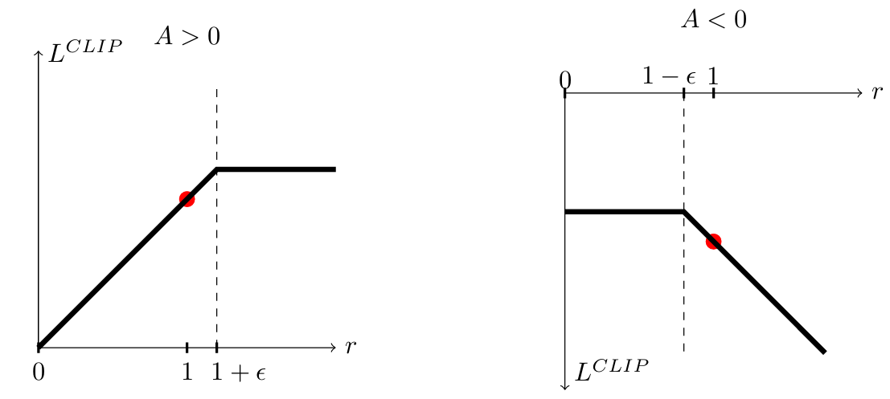

- When  $A_t>0$  (the action is better than the average level), the maximum update amplitude is limited to  $1+\epsilon$ , avoiding over-optimization of the action;

- When  $A_t<0$  (the action is worse than the average level), the wrong update amplitude is limited to  $1-\epsilon$ , avoiding the policy from learning bad actions and causing collapse.

#### 3.2.3 Full PPO Algorithm Flow (Humanoid Robot Training Practice)

The algorithm flow is fully bound to the actual training process of humanoid robots, focusing on operability:

1. **Sampling**: Use the current old policy  $\pi_{\theta_{\text{old}}}$  to interact with the humanoid robot simulation/environment, collect trajectory data including state  $s_t$  (joint angles, center of mass position, etc.), action  $a_t$  (joint torque, movement speed, etc.), and reward  $r_t$  (balance reward, task completion reward, etc.);
2. **Advantage Estimation**: Calculate the advantage function  $A_t$  for each time step using GAE, combining the immediate reward  $r_t$  and the state value  $V(s_t)$  predicted by the Critic, ensuring the stability of advantage estimation;
3. **Policy Update (Actor)**: Maximize the Clip objective function $L^{CLIP}(\theta)$ , update the policy network (Actor) via gradient ascent, and ensure that the policy update amplitude is within the range constrained by  $\epsilon$ ;
4. **Value Network Update (Critic)**: Minimize the value function loss  $L^{VF}(\theta) = \mathbb{E}_t\left[ \left( V(s_t;\theta) - R_t \right)^2 \right]$  ( $R_t$  is the cumulative discounted return), update the value network (Critic) via gradient descent, improving the accuracy of state value estimation;
5. **Iteration**: Repeat the above steps, update the old policy  $\pi_{\theta_{\text{old}}}$  to the new policy  $\pi_\theta$  after several updates, until the policy converges (the robot can stably complete the target task, such as bipedal walking, grasping, etc.).

## Code

### **Actor-Critic**

```
# Define Actor-Critic Network
class ActorCritic(nn.Module):  # Define the Actor-Critic model
    def __init__(self, state_dim, action_dim):  # Initialize with state and action dimensions
        super(ActorCritic, self).__init__()  # Call parent class constructor
        self.shared_layer = nn.Sequential(  # Shared network layers for feature extraction
            nn.Linear(state_dim, 128),  # Fully connected layer with 128 neurons
            nn.ReLU()  # ReLU activation function
        )
        self.actor = nn.Sequential(  # Define the actor (policy) network
            nn.Linear(128, action_dim),  # Fully connected layer to output action probabilities
            nn.Softmax(dim=-1)  # Softmax to ensure output is a probability distribution
        )
        self.critic = nn.Linear(128, 1)  # Define the critic (value) network to output state value

    def forward(self, state):  # Forward pass for the model
        shared = self.shared_layer(state)  # Pass state through shared layers
        action_probs = self.actor(shared)  # Get action probabilities from actor network
        state_value = self.critic(shared)  # Get state value from critic network
        return action_probs, state_value  # Return action probabilities and state value
```

### **the class of Memory**

```
# Memory to store experiences
class Memory:  # Class to store agent's experience
    def __init__(self):  # Initialize memory
        self.states = []  # List to store states
        self.actions = []  # List to store actions
        self.logprobs = []  # List to store log probabilities of actions
        self.rewards = []  # List to store rewards
        self.is_terminals = []  # List to store terminal state flags

    def clear(self):  # Clear memory after an update
        self.states = []  # Clear stored states
        self.actions = []  # Clear stored actions
        self.logprobs = []  # Clear stored log probabilities
        self.rewards = []  # Clear stored rewards
        self.is_terminals = []  # Clear terminal state flags
```

### **PPO initialization**

```
# PPO Agent
class PPO:  # Define the PPO agent
    def __init__(self, state_dim, action_dim, lr=0.002, gamma=0.99, eps_clip=0.2, K_epochs=4):
        self.policy = ActorCritic(state_dim, action_dim).to(device)  # Initialize the Actor-Critic model
        self.optimizer = optim.Adam(self.policy.parameters(), lr=lr)  # Adam optimizer for parameter updates
        self.policy_old = ActorCritic(state_dim, action_dim).to(device)  # Copy of the policy for stability
        self.policy_old.load_state_dict(self.policy.state_dict())  # Synchronize parameters
        self.MseLoss = nn.MSELoss()  # Mean Squared Error loss for critic updates

        self.gamma = gamma  # Discount factor for rewards
        self.eps_clip = eps_clip  # Clipping parameter for PPO
        self.K_epochs = K_epochs  # Number of epochs for optimization
```

### **action selection**

```
    def select_action(self, state, memory):
        state = torch.FloatTensor(state).to(device)  # Convert state to PyTorch tensor
        action_probs, _ = self.policy_old(state)  # Get action probabilities from old policy
        dist = Categorical(action_probs)  # Create a categorical distribution
        action = dist.sample()  # Sample an action from the distribution

        memory.states.append(state)  # Store state in memory
        memory.actions.append(action)  # Store action in memory
        memory.logprobs.append(dist.log_prob(action))  # Store log probability of the action

        return action.item()  # Return action as a scalar value
```

### **policy update**

```python
    def update(self, memory):
        # Convert memory to tensors
        old_states = torch.stack(memory.states).to(device).detach()  # Convert states to tensor
        old_actions = torch.stack(memory.actions).to(device).detach()  # Convert actions to tensor
        old_logprobs = torch.stack(memory.logprobs).to(device).detach()  # Convert log probabilities to tensor

        # Monte Carlo rewards
        rewards = []  # Initialize rewards list
        discounted_reward = 0  # Initialize discounted reward
        for reward, is_terminal in zip(reversed(memory.rewards), reversed(memory.is_terminals)):
            if is_terminal:  # If the state is terminal
                discounted_reward = 0  # Reset discounted reward
            discounted_reward = reward + (self.gamma * discounted_reward)  # Compute discounted reward
            rewards.insert(0, discounted_reward)  # Insert at the beginning of the list
        rewards = torch.tensor(rewards, dtype=torch.float32).to(device)  # Convert rewards to tensor
        rewards = (rewards - rewards.mean()) / (rewards.std() + 1e-7)  # Normalize rewards
```

**Surrogate Loss**

```
# Update for K epochs
        for _ in range(self.K_epochs):
            # Get action probabilities and state values
            action_probs, state_values = self.policy(old_states)  # Get action probabilities and state values
            dist = Categorical(action_probs)  # Create a categorical distribution
            new_logprobs = dist.log_prob(old_actions)  # Compute new log probabilities of actions
            entropy = dist.entropy()  # Compute entropy for exploration

            # Calculate ratios
            ratios = torch.exp(new_logprobs - old_logprobs.detach())  # Compute probability ratios

            # Advantages
            advantages = rewards - state_values.detach().squeeze()  # Compute advantages

            # Surrogate loss
            surr1 = ratios * advantages  # Surrogate loss 1
            surr2 = torch.clamp(ratios, 1 - self.eps_clip, 1 + self.eps_clip) * advantages  # Clipped loss
            loss_actor = -torch.min(surr1, surr2).mean()  # Actor loss

            # Critic loss
            loss_critic = self.MseLoss(state_values.squeeze(), rewards)  # Critic loss

            # Total loss
            loss = loss_actor + 0.5 * loss_critic - 0.01 * entropy.mean()  # Combined loss

            # Update policy
            self.optimizer.zero_grad()  # Zero the gradient buffers
            loss.backward()  # Backpropagate loss
            self.optimizer.step()  # Perform a parameter update

        # Update old policy
        self.policy_old.load_state_dict(self.policy.state_dict())  # Copy new policy parameters to old policy
```

### main function

```
# Hyperparameters
device = torch.device("cuda" if torch.cuda.is_available() else "cpu")  # Use GPU if available
env = gym.make("CartPole-v1")  # Initialize CartPole environment
state_dim = env.observation_space.shape[0]  # Dimension of state space
action_dim = env.action_space.n  # Number of possible actions
lr = 0.002  # Learning rate
gamma = 0.99  # Discount factor
eps_clip = 0.2  # Clipping parameter
K_epochs = 4  # Number of epochs for policy update
max_episodes = 1000  # Maximum number of episodes
max_timesteps = 300  # Maximum timesteps per episode

# PPO Training
ppo = PPO(state_dim, action_dim, lr, gamma, eps_clip, K_epochs)  # Initialize PPO agent
memory = Memory()  # Initialize memory

for episode in range(1, max_episodes + 1):  # Loop over episodes
    state = env.reset()  # Reset environment
    total_reward = 0  # Initialize total reward

    for t in range(max_timesteps):  # Loop over timesteps
        action = ppo.select_action(state, memory)  # Select action using PPO
        state, reward, done, _ = env.step(action)  # Take action and observe results

        memory.rewards.append(reward)  # Store reward in memory
        memory.is_terminals.append(done)  # Store terminal state flag in memory
        total_reward += reward  # Accumulate total reward

        if done:  # If episode is done
            break  # Exit loop

    ppo.update(memory)  # Update PPO agent
    memory.clear()  # Clear memory

    print(f"Episode {episode}, Total Reward: {total_reward}")  # Print episode statistics

env.close()  # Close the environment
```

## 4. Basic Knowledge of VLA Model (Focus on OpenVLA and Its Iteration)

### 4.1 Core Principle of VLA Model: Transformer-Based Multimodal Fusion

​ The Vision-Language-Action (VLA) model is an end-to-end multimodal framework that breaks the isolated "perception-understanding-execution" pipeline in traditional robot control systems. Its core design is to unify visual perception, natural language understanding, and robot action generation within a single Transformer architecture, enabling humanoid robots to flexibly execute natural language instructions and robustly adapt to unstructured dynamic environments. Unlike traditional modular systems where information is passed serially between independent perception, planning, and control modules, the VLA model achieves deep fusion of multimodal signals in a shared feature space, fundamentally avoiding error accumulation caused by cascaded module transmission.


​ The fundamental design philosophy of the VLA model is inspired by autoregressive Transformer models (e.g., GPT series). The core paradigm is to encode visual signals, language instructions, and robot proprioceptive states into discrete tokens, then fuse these heterogeneous tokens through a shared Transformer backbone, and finally generate executable robot control commands. The core mathematical framework of the general VLA paradigm is built on a unified token embedding space, and its overall workflow can be formalized by the following equations:

$$
\mathcal{F}(v, l, s)= \text{MultiModalSelfAttention}\left( \text{Concat}\left( \text{ViT}(v), \text{LLM}(l), \text{MLP}(s) \right) \right)
$$

$$
a_{1: T}= \text{TransformerDecoder} (\mathcal{F}(v, l, s))
$$

Where the variables and operators are defined as follows:

- $v$  : Visual input, typically RGB or RGB-D images of the operating environment captured by the humanoid robot’s onboard camera;

- $l$  : Natural language instruction that specifies the robot’s task (e.g., "Grasp the red cup on the table and hand it to me");

- $s$  : Robot proprioceptive state, including joint angles, end-effector 6D pose, and force-torque sensor data;

- $\text{ViT}(v)$  : Vision Transformer encoder, which maps raw visual input into structured visual tokens;

- $\text{LLM}(l)$  : Large Language Model encoder/embedding layer, which converts natural language instructions into semantic tokens with contextual information;

- $\text{MLP}(s)$  : Multi-Layer Perceptron, which projects low-dimensional robot state signals into state tokens compatible with the Transformer backbone;

- $\text{Concat}(\cdot)$  : Token concatenation operation, which aligns the sequence dimensions of visual, language, and state tokens to form a unified multimodal token sequence;

- $\text{MultiModalSelfAttention}(\cdot)$  : Multi-modal self-attention mechanism, which aligns and fuses visual, language, and state tokens into a unified shared embedding space within a single attention computation;

- $a_{1: T}$  : The generated T-step executable action sequence for robot control.

  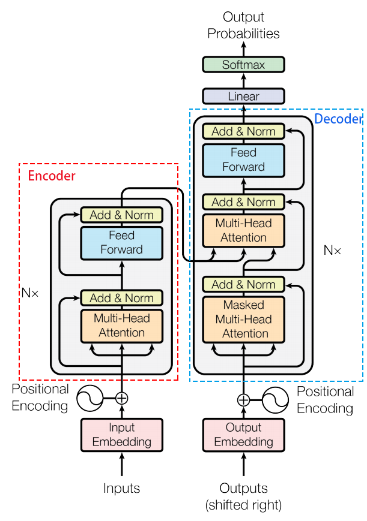

- position embedding: $PE_{pos}=\sin/\cos(\frac{pos}{10000^{2i/d_{model}}})$

- $\text{FFN}(x)=\max(0,xW_1+b_1)W_2+b_2$

- Add&Norm: $\text{LayerNorm}(x+\text{MultiHeadAttention}(x))$

- Self Attention: $\text{Attention}(Q,K,V)=\text{softmax}(\frac{QK^T}{\sqrt{d_k}})\cdot V$

  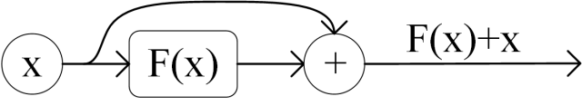

  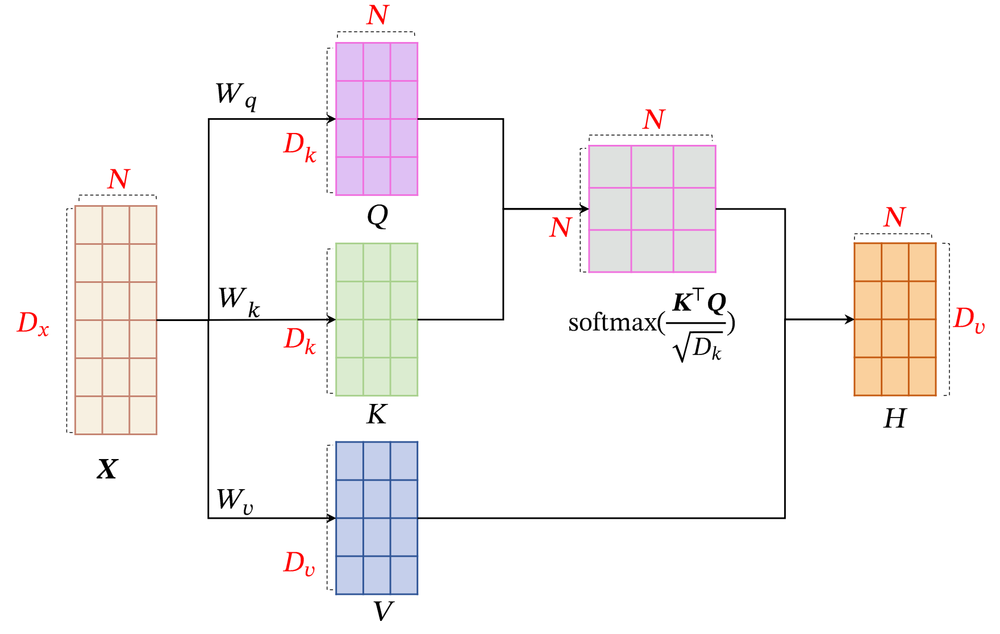

- Multi-Head Attention:$\text{MultiHead}=\text{Concat(head}_i)W^O$, where $head_i=$$\text{Attention}(Q,K,V)$

  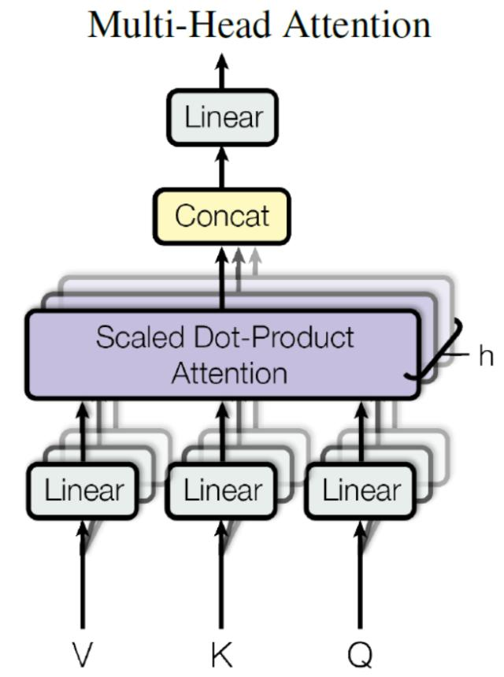

- position embedding: $PE_{pos}=\sin/\cos(\frac{pos}{10000^{2i/d_{model}}})$

- $\text{FFN}(x)=\max(0,xW_1+b_1)W_2+b_2$

- Add&Norm: $\text{LayerNorm}(x+\text{MultiHeadAttention}(x))$

​ The Transformer architecture is the core enabler of the VLA model’s powerful multimodal fusion and generalization capabilities. Unlike traditional modular systems that use independent models for each modality, the VLA model processes all modal tokens within a unified Transformer backbone, which guarantees end-to-end semantic, spatial, and temporal alignment across vision, language, and action. The self-attention mechanism of the Transformer allows the model to dynamically focus on task-critical information within each modality, for example, locating the target "red cup" in the visual input, extracting the core intent from the language instruction, and capturing the current motion limit of the robot arm from the proprioceptive state. Meanwhile, the cross-attention mechanism realizes bidirectional information interaction between different modalities, enabling the model to ground language semantics to visual spatial features, and map multimodal semantic understanding to robot action space—this is the core logic for the VLA model to achieve the "unity of perception, cognition and action".

### 4.2 Iterative Improvements of VLA Model: Representative Architectures and Principle Innovations

​ Based on OpenVLA’s core framework, VLA model iterations focus on solving humanoid robots’ pain points of real-time control, computational efficiency and complex scene adaptation. π₀.₅, the derivative iterative architecture of π₀, introduces Flow Matching to fix core limitations of discrete token-based VLAs, optimized for humanoid continuous joint control. To address inherent bottlenecks of single/dual-system architectures, the triple-system architecture decouples semantic reasoning, whole-body action generation and bipedal dynamic balance control, natively adapting to humanoid loco-manipulation requirements and eliminating performance trade-offs of traditional designs.

#### 4.2.1 π0.5：Advanced VLA Architecture with Flow Matching Mechanism

​ π0.5 is an advanced iterative Vision-Language-Action (VLA) architecture built on its predecessor π0. Its core innovation is integrating the Flow Matching mechanism to solve key limitations of discrete token-based VLA models (including OpenVLA): low autoregressive decoding efficiency, poor continuity of generated actions, and precision loss in continuous robot control. Its core design follows a hybrid paradigm: pre-training the model with discrete action tokens to retain high training efficiency and cross-modal alignment capability, then adopting Flow Matching for end-to-end continuous action generation via ODE solving, realizing efficient alignment between discrete pre-training and continuous execution — optimized for continuous joint control scenarios of humanoid robots.

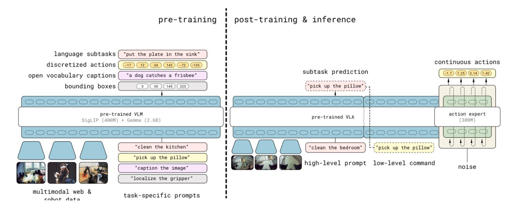

​ Flow Matching is a continuous generative model, whose core workflow forms a closed loop of **ODE gradient field fitting in training phase** and **ODE initial value problem extrapolation solving in inference phase**. During training, the model learns a continuous vector flow field, which essentially fits the gradient direction of the ordinary differential equation (ODE) that guides Gaussian random noise to evolve into real robot actions. During inference, the model maps random noise to executable continuous robot action sequences by solving the ODE via numerical forward extrapolation.

​ The core learning objective of Flow Matching is the flow function  $\mathbf{f}_\theta(a, \tau, o, \ell)$ , which gradually maps random noise  $\omega \sim \mathcal{N}(0, I)$  to the ground-truth action sequence  $a_{t:t+H}$  along the time index  $\tau \in [0,1]$ , where  $o$  is robot observation,  $\ell$  is the natural language instruction. The target vector field predicted by the network  $\mathbf{f}_\theta$  is exactly the time derivative term of the ODE governing action state evolution. The engineering-optimized mathematical framework used in π0.5 is as follows:

##### 1. Noisy Action Sample Construction

​ Noisy samples for flow field learning are built by linear interpolation between ground-truth action sequences and random noise via the time index  $\tau$ , which provides supervision signals for ODE gradient fitting:

$$
a_{t:t+H}^{\tau, \omega} = \tau \cdot a_{t:t+H} + (1-\tau) \cdot \omega
$$

Where  $H$  is the action sequence length (fixed to 49~50 steps in π0.5 to meet the continuity requirements of humanoid robot actions),  $\tau=0$  corresponds to pure noise (initial state of ODE solving), and  $\tau=1$  corresponds to the ground-truth action sequence (target state of ODE solving). To improve the stability of ODE fitting and convergence speed during inference, π0.5 adopts non-uniform sampling of  $\tau$  via Beta distribution during training, with an emphasis on low- $\tau$  samples, instead of uniform sampling over  $\tau \in [0,1]$ .

##### 2. Flow Matching Objective Function (ODE Gradient Fitting)

​ The core objective of model training is to make the learned flow field infinitely close to the theoretical optimal gradient direction of the ODE, and the fitting is completed by minimizing the flow field prediction error:

$$
\mathcal{L}_{flow }=\mathbb{E}_{\mathcal{D}, \tau, \omega}\left| f_{\theta}\left(a_{t: t+H}^{\tau, \omega}, o_{t}, \ell\right) - (a_{t: t+H} - \omega) \right| ^{2}
$$

Where D is the robot demonstration dataset,  $o_{t}$  is the robot observation (visual input + proprioceptive state) at t, and  $a_{t: t+H} - \omega$  is the theoretical optimal gradient direction of the ODE.

##### 3. ODE Inference & Forward Extrapolation for Action Generation

This is the core link of generating executable actions from the trained flow field, which is essentially **forward numerical extrapolation solving of the ODE initial value problem**.

After training, the learned flow function  $\mathbf{f}_\theta$  is exactly the time derivative of the ODE that controls the evolution of the action state, with the core ODE equation:

$$
\frac{da}{d\tau} = \mathbf{f}_\theta(a, \tau, o_t, \ell)
$$

The inference process is to solve the initial value problem of this ODE: we take the random noise  $a(0) = \omega \sim \mathcal{N}(0, I)$  with dimensions strictly matching the action space at  $\tau=0$  as the initial state, condition on the current visual observation, language instruction and proprioceptive state throughout the process, and extrapolate the action state step by step along the learned flow field via numerical method until  $\tau=1$ , to obtain the final continuous action sequence.

To meet the real-time control requirements of humanoid robots, π0.5 adopts the industry-standard forward Euler method to complete efficient extrapolation solving in only 10 steps, with the iteration formula:

$$
a(\tau_{k+1}) = a(\tau_k) + (\tau_{k+1} - \tau_k) \cdot \mathbf{f}_\theta(a(\tau_k), \tau_k, o_t, \ell)
$$

Where  $\tau_k = k/10$  for  $k \in [0,9]$ , and the final output  $a(1)$  is the complete continuous action sequence that can be directly executed by the robot.

This fully non-autoregressive ODE extrapolation generation mode completely avoids the step-by-step decoding delay of discrete token models, which is the core of realizing low-latency and high-smoothness continuous action generation.

##### 4. Joint Training Loss

π0.5 combines discrete token pre-training and continuous flow field learning with a hybrid loss function to balance training efficiency and action quality:

$$
\mathcal{L}_{\text{total}} = \mathbb{E}_{\mathcal{D}, \tau, \omega} \left[ H(x_{1:M}, f_\theta^\ell(o_t, \ell)) + \alpha \cdot \mathcal{L}_{\text{flow}} \right]
$$

Where  $H(\cdot)$  is the cross-entropy loss for discrete token prediction (covering text, vision and discrete action token pre-training tasks), and  $\alpha$  is the weight balancing the two loss terms, fixed to 10.0 in the post-training phase of π0.5.

#### 4.2.2 Triple-System Architecture: VLA Paradigm for Humanoid Whole-Body Loco-Manipulation

##### Core Motivation

The  core difference between humanoid robots and fixed-base manipulators  lies in three inherently conflicting rigid requirements that humanoids  must satisfy simultaneously:

1. Complex semantic reasoning for long-horizon tasks, which relies on  the strong cognitive capability of large models and has high tolerance  for inference latency;

2. Precise whole-body action generation for 30+ degrees of freedom,  which demands high-frequency, smooth joint control and has strict  requirements for model lightweighting and inference efficiency;

3. Real-time dynamic balance control for the bipedal floating base,  which requires sub-millisecond closed-loop control, is extremely  sensitive to latency, and any inference freeze in the upper layer will  directly cause the robot to fall.

Traditional architectures are fundamentally unable to resolve this core contradiction:

- For single-system architectures (e.g., RT-2, OpenVLA, π₀.₅): They  couple all three functions into one monolithic model. To reduce latency  for stable control, they have to sacrifice model capacity, which  eventually leads to comprehensive degradation in both reasoning ability  and action precision, creating an unsolvable dilemma between inference  capability and control frequency.

- For dual-system architectures (e.g., Helix): They only split  semantic reasoning and action generation, but still fail to isolate the  unique real-time dynamic balance control exclusive to humanoid robots.  Action generation and balance control remain coupled and conflicting,  making it impossible to achieve stable execution of "walking while  manipulating and reasoning" — the core scenario for humanoid robots.

To  address these inherent bottlenecks, the triple-system architecture is  proposed with a clear core design purpose: to completely decouple these  three conflicting core requirements into three independent closed-loop  yet deeply collaborative subsystems. Each subsystem only focuses on one  core objective, with no need to make performance compromises between  conflicting demands. This hierarchical design is natively aligned with  the inherent control requirements of humanoid robots, and fundamentally  eliminates the performance trade-offs of single and dual-system designs.

##### Representative Triple-System Designs

##### Ψ₀ (Psi-Zero) Triple-System Framework

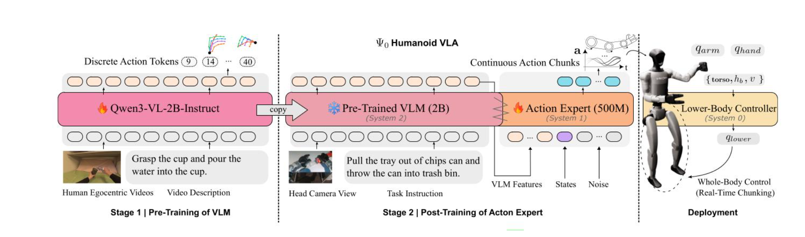

​ As a state-of-the-art open foundation model for humanoid loco-manipulation, Ψ₀ adopts a standardized triple-system hierarchy:

**System 2 (Slow Thinking, Semantic Reasoning)**:  Corresponding to the top-layer design objective, it adopts a  Qwen3-VL-2B-Instruct vision-language backbone, pre-trained on  large-scale egocentric human videos. It is dedicated to learning  generalizable visual-action representations, task semantics, and  long-horizon task planning capabilities, completely free from real-time  control constraints.

**System 1 (Fast Thinking, Action Generation)**:  Corresponding to the middle-layer design objective, it is a  500M-parameter flow-based MM-DiT action expert. Conditioned on the  frozen VLM features from System 2, it predicts precise whole-body  joint-space action chunks, focusing on upper-body dexterous manipulation  and coordinated torso control, with no need to handle balance control.

**System 0 (Physical Execution, Real-Time Stabilization)**:  Corresponding to the bottom-layer design objective, it is an RL-based  lower-body controller (AMO). It maps high-level locomotion commands to  15-DoF lower-body joint angles, and is exclusively responsible for  bipedal walking, dynamic balance, and torso stability in real time. This  independent closed-loop is completely unaffected by upper-layer  inference latency, serving as the core stability base of the robot.


##### PhysiFlow Bio-Inspired Multi-Brain Triple-System Design——Wholebody control

Our proposed PhysiFlow framework further optimizes the triple-system architecture with a bio-inspired design for physics-aware humanoid control:

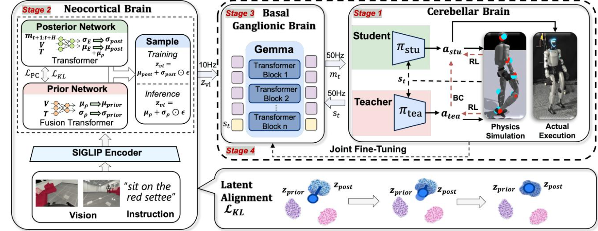

**Neocortical Brain (Semantic-Motion Intent Alignment)**:  Corresponding to the top-layer semantic reasoning objective, it is a  curriculum-based CVAE with a SigLIP encoder. It fuses vision-language  instructions to generate 10Hz semantic-motion latent vectors, and is  responsible for complex task understanding and motion intent reasoning,  isolated from real-time control constraints.

**Basal Ganglionic Brain (High-Frequency Action Generation)**:  Corresponding to the middle-layer action generation objective, it is a  lightweight Gemma-based latent flow-matching model. Taking semantic  latent vectors and robot states as input, it outputs 50Hz continuous  whole-body motion sequences, balancing action smoothness and inference  efficiency for whole-body coordinated control.

**Cerebellar Brain (Physics-Aware Stabilization)**:  Corresponding to the bottom-layer stability control objective, it is an  RL teacher-student motion tracker with an internal 1000Hz PD controller.  It enforces physical feasibility constraints and converts motion  sequences into stable motor commands, ensuring dynamic balance and  precise execution for humanoid whole-body control with an independent  hard real-time closed loop.

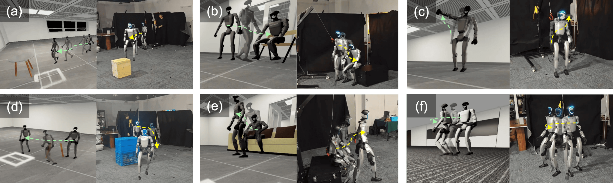


