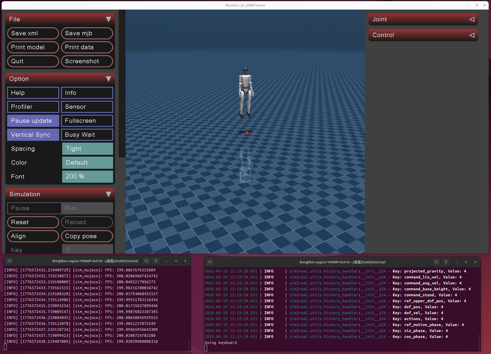
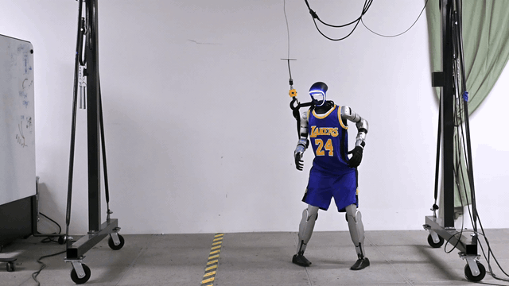
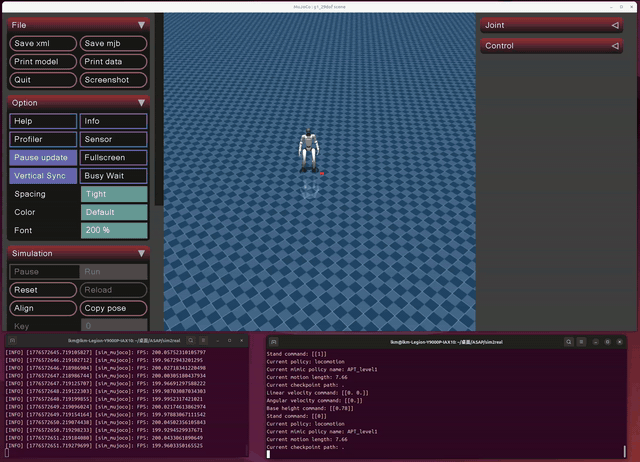
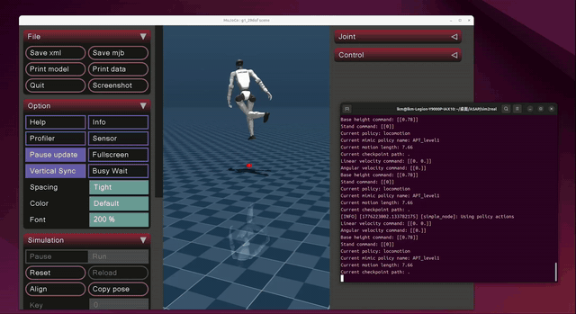
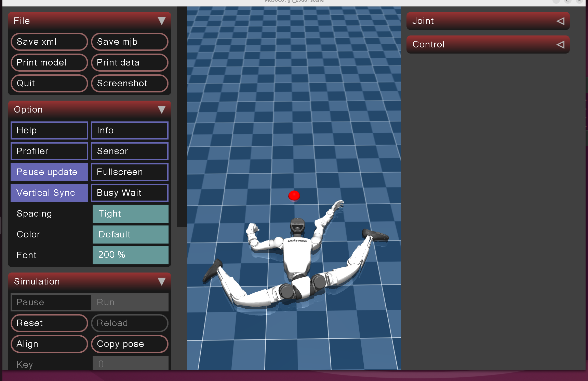

# ASAP 环境配置与Demo运行指南 / ASAP environment configuration and Demo running guide

> **ASAP**: Aligning Simulation and Real-World Physics for Learning Agile Humanoid Whole-Body Skills
>
> 论文来源 / Paper Source：RSS 2025 https://arxiv.org/abs/2502.01143 ｜ 仓库地址 / GitHub Repository：https://github.com/LeCAR-Lab/ASAP ｜ 项目主页 / Procject Home Page：https://agile.human2humanoid.com
>
> 环境适用于 Ubuntu 24.04 + NVIDIA GPU / The environment is available for Ubuntu 24.04 + NVIDIA GPU
>
> Created by LKM from SSTIA, 2026/4/17

> Update Log:
> | Time | Name | Update |
> |------| ---- |--------|
> |2026/4/18| LKM | Add English version |
> |2026/4/19| LKM | Add images |

---

> 💡 **遇到问题怎么办？ / What to do when meeting problems?**
>
> 环境配置过程中遇到报错是非常正常的事情，不同电脑的硬件、驱动、系统版本都可能带来差异，当你遇到问题时 / It is very normal to encounter errors in the process of environment configuration. Different computer hardware, drivers, and system versions may bring differences. When you encounter problems：
>
> 1. **先看本指南的 [附录 C：常见问题排查](#c-常见问题排查)**，其中记录了我们实际遇到过的各种坑 / **Start with [Appendix C: FAQs]** of this guide, which is a list of the kinds of pits we've actually encountered
> 2. **善用 LLM**（ChatGPT、Deepseek等）——把完整的报错信息贴给它，通常能快速定位原因 / **Use LLM** (ChatGPT, Deepseek, etc.) - Posting the full error message to it is often a quick way to pinpoint the cause
> 3. **在 GitHub、CSDN等平台搜索报错关键词**，大概率有人遇到过相同问题 / **Search for error keywords on GitHub, CSDN, etc.** and chances are someone has encountered the same issue
> 4. 如果以上都无法解决，欢迎在本仓库的 [Discussions](https://github.com/UMJI-SSTIA/Deep-Learning-Workshop/discussions) 中提问 / If all else fails, feel free to ask questions in the Discussions section of the GitHub repository

---

## 目录 / Catalogue

- [背景知识：这些工具都是什么？ / Background: What are these tools?](#背景知识这些工具都是什么)
- [方案一：从零开始配置 / Option 1: Configure from scratch](#方案一从零开始配置)
  - [0. 前置条件与显卡兼容性 / Preconditions and graphics card compatibility](#0-前置条件与显卡兼容性)
  - [1. 安装 NVIDIA 驱动 / Install NVIDIA drivers](#1-安装-nvidia-驱动)
  - [2. 安装 CUDA Toolkit 12.8 / Install CUDA Toolkit 12.8](#2-安装-cuda-toolkit-128)
  - [3. 安装 Miniconda 并创建环境 / Install Miniconda and create the environment](#3-安装-miniconda-并创建环境)
  - [4. 安装 PyTorch / Install PyTorch](#4-安装-pytorch)
  - [5. 克隆并安装 ASAP / Clone and install ASAP](#5-克隆并安装-asap)
  - [6. 安装 ROS2 Humble / Install ROS2 Humble](#6-安装-ros2-humble)
  - [7. 安装 Unitree SDK / Install Unitree SDK](#7-安装-unitree-sdk)
  - [8. 安装 sim2real 剩余依赖 / Install sim2real remaining dependencies](#8-安装-sim2real-剩余依赖)
  - [9. 运行 Demo / Run the demo](#9-运行-demo)
- [方案二：克隆预配置环境 / Option 2: Clone the preconfigured environment](#方案二克隆预配置环境)
  - [适用条件 / Conditions of application](#适用条件)
  - [配置步骤 / Configuration Steps](#配置步骤)
- [进阶：本地训练 / Advance: Local training](#进阶本地训练)
- [附录 / Appendix](#附录)
  - [A. 键盘控制说明 / Keyboard Control Instructions](#a-键盘控制说明)
  - [B. 预训练动作列表 / List of pre-trained actions](#b-预训练动作列表)
  - [C. 常见问题排查 / Common questions](#c-常见问题排查)

---

## 背景知识：这些工具都是什么？
## Background: What are these tools?
在开始安装之前，先简单了解一下我们会用到的各种工具和库，方便你理解每一步在做什么 / Before we get started, let's take a quick look at the various tools and libraries we'll be using so you understand what we're doing at each step：

**系统层 / System**

| 工具 / Tools | 作用 / Functions |
|------|------|
| **NVIDIA 驱动 / NVIDIA Drivers** | 让操作系统能识别和使用你的 NVIDIA 显卡，是一切 GPU 计算的基础 / Enabling the operating system to recognize and use your NVIDIA graphics card is the foundation of all GPU computing|
| **CUDA Toolkit** | NVIDIA 的 GPU 并行计算平台，深度学习框架（如 PyTorch）依赖它来在 GPU 上运行计算 / NVIDIA's GPU parallel computing platform, which deep learning frameworks such as PyTorch rely on to run computations on Gpus|
| **Miniconda** | Python 环境管理工具，可以创建隔离的虚拟环境，避免不同项目之间的依赖冲突 / Python environment manager, which can create isolated virtual environments and avoid dependency conflicts between different projects|

**核心框架 / Core Frameworks**

| 工具 / Tools | 作用 / Functions |
|------|------|
| **PyTorch** | 主流深度学习框架，ASAP 用它来训练和运行强化学习策略 / Mainstream deep learning framework, which ASAP uses to train and run reinforcement learning policies|
| **Genesis** | 轻量级物理仿真引擎，ASAP 用它模拟机器人在虚拟世界中的运动（替代原版教程中的 Isaac Gym） / Lightweight physics simulation engine that ASAP uses to simulate robot motion in a virtual world (replace Isaac Gym in the original tutorial)|
| **MuJoCo** | 另一个物理仿真引擎，ASAP 在 sim2sim 可视化 demo 中用它来渲染机器人 / Another physics simulation engine, ASAP uses it to render robots in the sim2sim visualization demo|

**通信与硬件 / Communication and Hardware**

| 工具 / Tools | 作用 /  Functions |
|------|------|
| **ROS2 Humble** | 机器人操作系统，提供进程间通信机制，ASAP 的仿真环境和策略控制器通过 ROS2 话题通信 / The robot operating system, which provides an inter-process communication mechanism, the simulation environment of ASAP and the policy controller communicate through ROS2 topics|
| **Unitree SDK** | Unitree（宇树）机器人的 Python SDK，用于与 G1 人形机器人通信 / Python SDK for Unitree robot to communicate with G1 humanoid robot|
| **ONNX Runtime** | 模型推理引擎，将训练好的策略模型高效地部署运行 / Model inference engine can efficiently deploy and run the trained policy model|

**ASAP 本体 / ASAP itself**

| 模块 / Sections | 作用 / Functions |
|------|------|
| **humanoidverse/** | 训练框架，包含环境定义、奖励函数、机器人模型等 / Training framework, which contains environment definition, reward function, robot model, etc|
| **sim2real/** | 部署模块，把训练好的策略在 MuJoCo 仿真（sim2sim）或真实机器人（sim2real）上运行 / Deploy modules to run the trained policies on a MuJoCo simulation (sim2sim) or a real robot (sim2real)|
| **isaac_utils/** | 工具库，提供数学计算、旋转变换等辅助函数 / Tool library, provides mathematical calculation, rotation transformation and other auxiliary functions|

---

## 方案一：从零开始配置
## Option 1: Configure from scratch

适用于全新安装的 Ubuntu 24.04 系统。 / It works on freshly installed Ubuntu 24.04 systems.

### 0. 前置条件与显卡兼容性

### Preconditions and graphics card compatibility

**操作系统 / System**：Ubuntu 24.04 LTS

**显卡要求 / Graphics card requirements**：NVIDIA GPU，显存 ≥ 8GB，不同显卡的关键差异如下 / NVIDIA GPU with ≥ 8GB of video memory, the key differences between different graphics cards are as follows：

| 显卡系列 / Graphics card series | 架构 / Architecture | 驱动要求 / Driver Requirements | PyTorch 要求 / PyTorch Requirements |
|----------|------|----------|-------------|
| RTX 50 series（5060/5070/5080/5090） | Blackwell (sm_120) | **必须用 `nvidia-driver-570-open`（开源内核模块） / Must use `nvidia-driver-570-open` (open-source kernel module)** | **必须用 nightly cu128 / Must use nightly cu128** |
| RTX 40 series（4060/4070/4080/4090） | Ada Lovelace (sm_89) | 闭源或开源驱动均可（≥535） / Closed or open source drivers (≥535) | 稳定版 cu121/cu124 均可 / Stable cu121/cu124 |
| RTX 30 series（3060/3070/3080/3090） | Ampere (sm_86) | 闭源或开源驱动均可（≥525） / Closed or open source drivers (≥525) | 稳定版 cu121/cu124 均可 / Stable cu121/cu124 |

> ⚠️ **RTX 50 系用户特别注意 / The RTX 50 users need to be careful**：Blackwell 架构**必须**使用开源内核模块驱动，否则 `nvidia-smi` 会报 "No devices were found"；PyTorch 官方稳定版也不支持 sm_120，必须使用 nightly 版本。 / Blackwell architecture **must** use open source kernel module drivers, otherwise `nvidia-smi` will report "No devices were found"; sm_120 is also not supported in the official stable version of PyTorch and you must use the nightly version.

> ⚠️ **关于 Isaac Gym / About Issac Gym**：ASAP 原版教程基于 Isaac Gym + Ubuntu 20.04，但Isaac Gym 预编译二进制与 Ubuntu 24.04 的 glibc 2.39 存在 ABI 不兼容（直接段错误）。本指南统一使用 **Genesis** 仿真器，ASAP 同时支持两者，功能无差异。 / The original ASAP tutorial is based on Isaac Gym + Ubuntu 20.04, but Isaac Gym prebuilt binary has ABI incompatibility with glibc 2.39 of Ubuntu 24.04 (direct segment error). This guide uses the **Genesis** emulator in the same way, ASAP supports both without any difference in functionality.

> 💡 **关于网络问题 / About Network Issues**：本指南中多个步骤需要从国外服务器下载文件（PyTorch、pip 包、GitHub 仓库等）。如果你遇上下载速度很慢或连接超时等问题，建议**打开全局代理**，或使用清华镜像源（在 pip 命令末尾加 `-i https://pypi.tuna.tsinghua.edu.cn/simple`），本指南后续不再逐一提醒。 / Many of the steps in this guide require downloading files from foreign servers (PyTorch, pip packages, GitHub repositories, etc.). If you meets the download speed is slow or connection timeout problems, suggest **open global agency**, or the use of tsinghua mirror source (at the end of the PIP command add `-i https://pypi.tuna.tsinghua.edu.cn/simple`), this guide no longer remind this one by one.

---

### 1. 安装 NVIDIA 驱动
### Install NVIDIA drivers

#### 1.1 清除旧驱动（如有）
#### Remove old drivers (if there are)

如果系统中已有 NVIDIA 驱动残留，先彻底清除 / If there are any NVIDIA drivers left in the system, remove them completely：

```bash
sudo dpkg --remove --force-remove-reinstreq \
  $(dpkg -l | grep -i nvidia | awk '{print $2}' | tr '\n' ' ')
sudo apt-get purge -y 'nvidia-*' 'libnvidia-*' 'cuda-*' 'libcuda-*'
sudo apt-get autoremove -y --purge
sudo dpkg --configure -a
```

#### 1.2 安装驱动
#### Install the drivers

**RTX 50 series（必须使用开源内核模块 / Open-source kernel modules must be used）：**

```bash
sudo apt-get update
sudo apt-get install -y nvidia-kernel-open-570 nvidia-utils-570 libnvidia-gl-570
```

如果安装过程中遇到文件冲突（`15_nvidia_gbm.json`），执行 / If you encounter a file conflict during installation (`15_nvidia_gbm.json`), execute：

```bash
sudo rm -f /usr/share/egl/egl_external_platform.d/15_nvidia_gbm.json
sudo dpkg -i --force-overwrite /var/cache/apt/archives/libnvidia-gl-570_570.211.01-0ubuntu1_amd64.deb
sudo apt-get install -f -y
```

**RTX 30/40 series：**

```bash
sudo apt-get update
sudo apt-get install -y nvidia-driver-570
```

#### 1.3 重启并验证
#### Reboot and check

```bash
sudo reboot
```

重启后 / After reboot：

```bash
nvidia-smi
```

你应该看到类似以下的输出（具体数字因显卡不同而异） / You should see output similar to the following (the exact number varies from card to card)：

```
+-----------------------------------------------------------------------------------------+
| NVIDIA-SMI 570.211.01             Driver Version: 570.211.01     CUDA Version: 12.8     |
|-----------------------------------------+------------------------+----------------------+
| GPU  Name                 Persistence-M | Bus-Id          Disp.A | Volatile Uncorr. ECC |
| Fan  Temp   Perf          Pwr:Usage/Cap |           Memory-Usage | GPU-Util  Compute M. |
|=========================================+========================+======================|
|   0  NVIDIA GeForce RTX 5060 ...    On  |   00000000:02:00.0 Off |                  N/A |
| N/A   44C    P8              4W /   50W |      15MiB /   8151MiB |      0%      Default |
+-----------------------------------------+------------------------+----------------------+
```

关键确认项：**Driver Version** 显示 570.x，**CUDA Version** 显示 12.8，**GPU Name** 显示你的显卡型号。如果报错，参见 [附录 C](#c-常见问题排查)。 / Key validators: **Driver Version** shows 570.x, **CUDA Version** shows 12.8, **GPU Name** shows your graphics card model. If you get an error, see [Appendix C].

---

### 2. 安装 CUDA Toolkit 12.8
### Install CUDA Toolkit 12.8

CUDA Toolkit 包含编译器（`nvcc`）和各种 GPU 计算库，是 PyTorch 等框架的底层依赖。 / The CUDA Toolkit contains a compiler (`nvcc`) and various GPU computing libraries, and is a low-level dependency of frameworks like PyTorch.

```bash
wget https://developer.download.nvidia.com/compute/cuda/repos/ubuntu2404/x86_64/cuda-keyring_1.1-1_all.deb
sudo dpkg -i cuda-keyring_1.1-1_all.deb
sudo apt-get update
sudo apt-get install -y cuda-toolkit-12-8
```

配置环境变量（告诉系统去哪里找 CUDA） / Configuring environment variables (telling the system where to find CUDA)：

```bash
echo 'export PATH=/usr/local/cuda-12.8/bin:$PATH' >> ~/.bashrc
echo 'export LD_LIBRARY_PATH=/usr/local/cuda-12.8/lib64:$LD_LIBRARY_PATH' >> ~/.bashrc
source ~/.bashrc
```

验证 / Check：

```bash
nvcc --version
```

预期输出 / Expected output：

```
nvcc: NVIDIA (R) Cuda compiler driver
Copyright (c) 2005-2025 NVIDIA Corporation
Built on Fri_Feb_21_20:23:50_PST_2025
Cuda compilation tools, release 12.8, V12.8.93
Build cuda_12.8.r12.8/compiler.35583870_0
```

关键确认项 / Key validators：`release 12.8`。

安装 OpenGL 相关依赖（Genesis 的渲染功能需要） / Install OpenGL dependencies (required for Genesis rendering)：

```bash
sudo apt-get install -y libgl1 libglu1-mesa mesa-utils xvfb
```

---

### 3. 安装 Miniconda 并创建环境
### Install Miniconda and create the environment

Miniconda 是一个轻量级的 Python 环境管理器，我们用它创建一个独立的虚拟环境，这样 ASAP 的依赖不会和你系统中的其他 Python 项目冲突。 / Miniconda is a lightweight Python environment manager that we use to create a standalone virtual environment so that ASAP dependencies don't conflict with other Python projects on your system.

如果你还没有安装 Miniconda / If you haven't installed Miniconda yet：

```bash
wget https://repo.anaconda.com/miniconda/Miniconda3-latest-Linux-x86_64.sh
bash Miniconda3-latest-Linux-x86_64.sh
```

按提示完成安装。安装过程中会问你安装路径，**默认路径是 `~/miniconda3`**（即 `/home/你的用户名/miniconda3`），直接回车即可。如果你改了路径，后面涉及 `miniconda3` 的命令都需要相应替换。安装完成后**关闭并重新打开终端**. / Follow the prompts to complete the installation. You will be asked for the installation path. **The default path is `~/miniconda3 `** (`/home/ your username /miniconda3`). If you change the path, subsequent commands involving `miniconda3` will need to replace it accordingly. **Close and reopen the terminal** once the installation is complete.

创建并激活环境 / create and activate the environment：

```bash
conda create -n hvgen python=3.10 -y
conda activate hvgen
```

配置 conda 环境的动态库路径（某些库需要从 conda 环境目录加载 `.so` 文件） / conda environment's dynamic library path (some libraries require loading `.so `files from the conda environment directory)：

```bash
# ⚠️ 如果你的 Miniconda 不是装在默认路径 ~/miniconda3，
#    请将下面的路径替换为你的实际安装路径。
#    例如装在 ~/anaconda3 则改为 ~/anaconda3/envs/hvgen/lib
#    不确定路径？运行 `conda info` 查看 "active env location" 一行
#
# ⚠️ If you don't install Miniconda in the default ~/miniconda3,
#    Please replace the path below with your actual installation path.
#    For example in ~/anaconda3, then change into ~/anaconda3/envs/hvgen/lib
#    Uncertain path? Run `conda info` to see the line "active env location"
echo "export LD_LIBRARY_PATH=$HOME/miniconda3/envs/hvgen/lib:\$LD_LIBRARY_PATH" >> ~/.bashrc
source ~/.bashrc
conda activate hvgen
```

---

### 4. 安装 PyTorch
### Install PyTorch

PyTorch 是本项目的核心深度学习框架，根据你的显卡选择对应命令 / PyTorch is the core deep learning framework for this project. Choose the appropriate command depending on your graphics card：

**RTX 50 series（必须使用 nightly cu128 / Must use nightly cu128）：**

```bash
pip install --pre torch --index-url https://download.pytorch.org/whl/nightly/cu128
```

**RTX 30/40 series（可使用稳定版 / Stable version available）：**

```bash
pip install torch --index-url https://download.pytorch.org/whl/cu124
```

验证 / Check：

```bash
python -c "
import torch
print('CUDA available:', torch.cuda.is_available())
print('CUDA version:', torch.version.cuda)
print('GPU:', torch.cuda.get_device_name(0))
x = torch.randn(2, 64, 512, device='cuda', dtype=torch.float16)
print('Tensor shape:', x.shape)
"
```

预期输出（GPU 型号因人而异） / Expected output (GPU model varies from person to person)：

```
CUDA available: True
CUDA version: 12.8
GPU: NVIDIA GeForce RTX 5060 Laptop GPU
Tensor shape: torch.Size([2, 64, 512])
```

关键确认项：`CUDA available: True`，且 `torch.randn` 在 GPU 上运行无报错。如果输出 `False`，参见 [附录 C](#c-常见问题排查)。 / Key validation: `CUDA available: True` and `torch.randn` runs on GPU without errors. If the output is `False`, see [Appendix C].

---

### 5. 克隆并安装 ASAP
### Clone and install ASAP

```bash
cd ~
git clone https://github.com/LeCAR-Lab/ASAP.git
cd ASAP
```

**按顺序安装依赖（版本锁定非常重要，不要随意升级） / Install dependencies in order (version locking is very important, don't arbitrarily upgrade)：**

```bash
# genesis-world：轻量级物理仿真引擎，必须为 0.2.1（更新版本 API 不兼容）
# Lightweight physics simulation engine, must be 0.2.1 (newer API not compatible) 
pip install genesis-world==0.2.1

# libigl：几何计算库，Genesis 内部用它计算碰撞距离,必须为 2.4.1（2.6.1 的 signed_distance 函数返回值数量变化会导致报错）
# Geometry calculation library, used internally by Genesis to calculate collision distance, must be 2.4.1 (2.6.1's signed_distance function returns an error when the number varies)
pip install libigl==2.4.1

# numpy：数值计算库，ASAP 代码要求锁定此版本
# Numeric computation library, ASAP code requires locking this version
pip install numpy==1.23.5

# 安装 ASAP 本体（--no-deps 防止自动安装的依赖覆盖上面锁定的版本）
# Install the ASAP ontology (--no-deps prevents automatically installed dependencies from overwriting locked versions)
pip install -e . --no-deps

# 安装 isaac_utils 工具库（提供旋转变换、数学辅助函数等）
# Install the isaac_utils library (which provides rotation transformations, math helper functions, etc.)
pip install -e isaac_utils

# 安装 requirements.txt 中的其余依赖
# Install the remaining dependencies from requirements.txt
pip install -r requirements.txt

# 补充安装 Genesis 和 Isaac 需要的库
# Additional libraries needed to install Genesis and Isaac
pip install scipy imageio
```

---

### 6. 安装 ROS2 Humble
### Install ROS2 Humble

ROS2（Robot Operating System 2）是机器人领域的标准通信框架。ASAP 的仿真环境（终端 1）和策略控制器（终端 2）之间通过 ROS2 话题（topic）交换数据。通过 conda 的 robostack 渠道安装 / Robot Operating System 2 (ROS2) is a standard communication framework in the field of robotics. Data is exchanged between the simulation environment of ASAP (terminal 1) and the policy controller (terminal 2) via ROS2 topics. Install via conda's robostack channel：

```bash
conda activate hvgen
conda config --env --add channels conda-forge
conda config --env --add channels robostack-staging
conda config --env --remove channels defaults
conda install ros-humble-desktop -y
```

验证 / Check：

```bash
python -c "import rclpy; print('rclpy OK')"
```

预期输出 / Expected output：

```
rclpy OK
```

---

### 7. 安装 Unitree SDK

Unitree SDK 是宇树机器人的 Python 开发包，提供与 G1 人形机器人通信的接口（sim2sim 也需要它来模拟通信协议）。 / The Unitree SDK is a Python development package for the Yushu robot that provides an interface to communicate with the G1 humanoid robot (sim2sim also needs it to simulate the communication protocol).

```bash
cd ~
git clone https://github.com/unitreerobotics/unitree_sdk2_python.git
cd unitree_sdk2_python
pip install -e .

# 修复可能的版本冲突
# Fix possible version conflicts
pip install --upgrade numpy scipy
```

---

### 8. 安装 sim2real 剩余依赖
### Install sim2real remaining dependencies

```bash
# mujoco：物理仿真引擎，用于 sim2sim 可视化
# Physics simulation engine, for sim2sim visualization
# onnxruntime：模型推理引擎，加载预训练的 .onnx 策略模型
# Model inference engine, which loads the pretrained.onnx policy model
# pygame：提供游戏开发基础功能，这里用于仿真环境的窗口和事件处理
# Provides basic functionality for game development, here used to simulate the environment window and event handling
# sshkeyboard：监听键盘按键，用于在终端中通过键盘控制机器人
# Listen for keystrokes, used to control the robot from the keyboard in the terminal
pip install mujoco onnxruntime pygame sshkeyboard
```

---

### 9. 运行 Demo
### Run the Demo

#### 9.1 训练测试（验证环境安装是否正确）
#### Training test (to verify that the environment is installed correctly)

这一步会在 Genesis 仿真器中启动 1 个并行环境，训练 G1 机器人的行走策略。我们用它来验证整个环境是否安装正确。 / This step starts 1024 parallel environments in the Genesis simulator to train the walking strategy of the G1 robot. We use it to verify that the entire environment is installed correctly.

```bash
conda activate hvgen
cd ~/ASAP

python humanoidverse/train_agent.py \
  +simulator=genesis \
  +exp=locomotion \
  +domain_rand=NO_domain_rand \
  +rewards=loco/reward_g1_locomotion \
  +robot=g1/g1_29dof_anneal_23dof \
  +terrain=terrain_locomotion_plane \
  +obs=loco/leggedloco_obs_singlestep_withlinvel \
  num_envs=1 \
  project_name=TestGenesisInstallation \
  experiment_name=G123dof_loco \
  headless=True
```

如果一切正常，你会看到 Genesis 初始化信息，然后开始输出训练日志 / If everything goes well, you should see Genesis initialization and start logging out your training：

```
[Genesis] [12:07:33] [INFO] 🚀 Genesis initialized. 🔖 version: 0.2.1
[Genesis] [12:07:33] [INFO] Running on [NVIDIA GeForce RTX 5060 Laptop GPU] with backend gs.cuda.
...
╭──────────────────────────────── Training Log ────────────────────────────────╮
│                       Learning iteration 0/1000000                          │
│                        Computation: 3579 steps/s                            │
│              Mean action noise std: 0.80                                    │
│  Mean episode rew_tracking_lin_vel: 0.0002                                  │
│                    Total timesteps: 24576                                   │
│                     Iteration time: 6.87s                                   │
╰──────────────────────────────────────────────────────────────────────────────╯
```

看到 Training Log 就说明环境配置成功了。**按 `Ctrl+C` 停止训练即可**，不需要等它跑完（完整训练需要数小时到数天）。 / If you see the Training Log, the environment was configured successfully. **Stop training by pressing `Ctrl+C`**, don't wait for it to finish (full training can take hours to days).

如果 Genesis 报 EGL 错误，设置以下环境变量后重试 / If Genesis gives an EGL error, set the following environment variables and try again：

```bash
export __EGL_VENDOR_LIBRARY_FILENAMES=/usr/share/glvnd/egl_vendor.d/10_nvidia.json
export __NV_PRIME_RENDER_OFFLOAD=1
export __GLX_VENDOR_LIBRARY_NAME=nvidia
export VK_ICD_FILENAMES=/etc/vulkan/icd.d/nvidia_icd.json
```

#### 9.2 Sim2Sim 可视化 Demo（预训练模型）
#### Sim2Sim Visualization Demo (pre-trained model)

这是最有趣的部分——你将在 MuJoCo 仿真中看到 G1 机器人执行各种动作。需要**两个终端**同时运行。 / This is the most interesting part - you'll see the G1 robot perform various actions in the MuJoCo simulation. **Two terminals** are needed to run at the same time.

**终端 1 — 启动 MuJoCo 仿真环境 / Terminal 1 - Start the MuJoCo simulation environment：**

```bash
conda activate hvgen
cd ~/ASAP/sim2real
python sim_env/base_sim.py --config=config/g1_29dof_hist.yaml
```

等待 MuJoCo 可视化窗口弹出后，再开启终端 2。 / Wait for the MuJoCo visualization window to pop up before opening Terminal 2.

**终端 2 — 启动策略控制 / Terminal 2 - Start policy control：**

```bash
conda activate hvgen
cd ~/ASAP/sim2real
python rl_policy/deepmimic_dec_loco_height.py \
  --config=config/g1_29dof_hist.yaml \
  --loco_model_path=./models/dec_loco/20250109_231507-noDR_rand_history_loco_stand_height_noise-decoupled_locomotion-g1_29dof/model_6600.onnx \
  --mimic_model_paths=./models/mimic
```



初始状态 / Initial State

#### 9.3 启动后的操作顺序
#### Sequence of operations after startup

机器人初始状态下有一根隐形的"安全绳"将它悬挂在空中,你需要按照正确的顺序操作，否则机器人会直接瘫倒在地面。 / The robot is initially suspended in the air by an invisible "safety rope", which you need to follow in the right order or the robot will simply collapse to the ground.

**正确操作顺序 / Correct sequence of operations：**

1. **在终端 2 中按 `]`** → 激活策略（此时机器人仍被安全绳悬挂） / **Press `]`** → Activate the policy in terminal 2 (while the robot is still suspended by the safety rope)
2. **在终端 2 中按 `=`** → 开启行走模式（机器人的腿开始做行走动作，但仍在空中） / **In Terminal 2 press `=`** → to enable walking mode (the robot's legs start to perform walking motions, but are still in the air)
3. **在 MuJoCo 仿真窗口中按 `9`** → 释放安全绳，机器人落地并开始自主平衡行走 / **Press `9`** → to release the safety rope in the MuJoCo simulation window. The robot lands and starts balancing autonomously

> ⚠️ **注意**：必须先激活策略并开启行走模式（步骤 1、2），再释放安全绳（步骤 3）。如果在策略未激活时直接释放，机器人无法保持平衡，会直接瘫倒。 / **Note** : You must first activate the policy and enable the walking mode (steps 1 and 2) before releasing the safety rope (Step 3). If released directly when the strategy is not activated, the robot cannot maintain its balance and will simply collapse.

4. 用 `w/a/s/d` 控制移动，`q/e` 控制转向 / Use `w/a/s/d` to control movement and `q/e` to control steering
5. 按 `;` 或 `'` 切换动作，按 `[` 执行当前动作 / Press the `;` or `'` toggles the action, pressing `[` to execute the current action


正确释放安全绳 + 基本移动 / Realease the safety rope correctly + Basic move




科比后仰跳投 / Kobe Motion

详细按键说明见 [附录 A](#a-键盘控制说明)，可用动作列表见 [附录 B](#b-预训练动作列表)。/ See [Appendix A] for a detailed description of key presses and [Appendix B] for a list of available actions.

---

## 方案二：克隆预配置环境
## Option 2: Clone the preconfigured 

我们已将完整的 ASAP 项目（含预训练模型和环境配置文件）上传到了 [GitHub 仓库](https://github.com/UMJI-SSTIA/Deep-Learning-Workshop/tree/2026/ASAP_prebuilt)中，你可以直接克隆使用。 / We've uploaded the full ASAP project (with pre-trained models and environment config files) to our GitHub repository that you can clone and use directly.

### 适用条件 / Conditions of application 

| 条件 / Conditions | 要求 / Requirements |
|------|------|
| 操作系统 / System | Ubuntu 24.04 LTS |
| 显卡 / Graphics card | NVIDIA GPU，显存 ≥ 8GB |
| 驱动 / Driver | 已安装（RTX 50 系必须用 nvidia-driver-570-open） |
| CUDA | 12.8 已安装 |
| Miniconda | 已安装 |

> 驱动、CUDA、Miniconda 无法通过 GitHub 分发，必须提前装好。如果没装，请先按方案一的**第 1-3 步**完成（只需做到"创建并激活 conda 环境"即可，后续步骤按照方案二）。 / Drivers, CUDA, and Miniconda cannot be distributed via GitHub and must be installed in advance. If not, follow **Steps 1-3** of Option 1 (just do "Create and activate conda environment", then follow Solution 2).

### 配置步骤 / Configuration Steps

#### 步骤 1 / Step 1：确认驱动和 CUDA / Confirm driver and CUDA

```bash
nvidia-smi
nvcc --version
```

确认 `nvidia-smi` 正常显示显卡信息，`nvcc --version` 显示 `release 12.8`。如有问题，参考方案一第 1、2 步。 / Make sure `nvidia-smi` displays graphics card information and `nvcc --version` displays ` release 12.8`. If there are any questions, refer to step 1 and 2 of Option 1.

#### 步骤 2 / Step 2：克隆仓库 / Clone the repository

```bash
cd ~
git clone https://github.com/UMJI-SSTIA/Deep-Learning-Workshop.git
cd Deep-Learning-Workshop/ASAP_prebuilt
```

仓库中的 `ASAP_prebuilt/` 目录结构如下 / The `ASAP_prebuilt/` directory in the repository is structured like this：

```
ASAP_prebuilt/
├── ASAP/                     # 完整的 ASAP 项目代码 + 预训练模型 / Complete ASAP project code + pre-trained model
│   ├── humanoidverse/        # 训练框架 / Training framework
│   ├── sim2real/             # Sim2Sim / Sim2Real 部署 / deployment
│   │   └── models/           # 预训练模型文件 / Pre-trained model file（.onnx）
│   ├── isaac_utils/          # 工具库 / Tool library
│   ├── requirements.txt
│   └── setup.py
│   └── README.md             # ASAP项目说明 / ASAP Project Description
├── environment.yml           # conda 环境导出（优先尝试）  /conda environment export (try first)
├── pip_requirements.txt      # pip freeze 参考（不可直接使用） / pip freeze reference (not available directly)
└── setup.sh                  # 一键安装脚本 / Install scripts
```

#### 步骤 3：运行一键安装脚本

```bash
chmod +x setup.sh
./setup.sh
```

脚本会自动完成以下工作：检查驱动/CUDA/conda → 从 `environment.yml` 恢复 conda 环境（失败则自动回退到手动安装全部依赖）→ 安装 Unitree SDK、ASAP、isaac_utils → 配置环境变量 → 安装系统依赖 → 验证所有关键库。 / The script automatically does the following: Check driver /CUDA/conda → restore the conda environment from 'environment.yml' (in case of failure, automatically fall back to manually installing all dependencies) → Install Unitree SDK, ASAP, isaac_utils → Configure environment variables → Install system dependencies → Verify all critical libraries.

安装完成后 / After install：

```bash
source ~/.bashrc
conda activate hvgen
```

> **如果脚本报错**，可以改为手动安装：按方案一的第 3-8 步操作，但将所有路径中的 `~/ASAP` 替换为 `~/Deep-Learning-Workshop/ASAP_prebuilt/ASAP`。/ **If the script fails**, you can install it manually instead: follow Steps 3-8 of Solution 1, but replace `~/ASAP` with `~/Deep-Learning-Workshop/ASAP_prebuilt/ASAP` in all paths

#### 步骤 4：运行 Demo

参照 [方案一第 9 步](#9-运行-demo)，但注意路径 / Refer to [Option 1, Step 9], but note the path：

```bash
conda activate hvgen

# 训练测试
# Training test
cd ~/Deep-Learning-Workshop/ASAP_prebuilt/ASAP
python humanoidverse/train_agent.py \
  +simulator=genesis \
  +exp=locomotion \
  +domain_rand=NO_domain_rand \
  +rewards=loco/reward_g1_locomotion \
  +robot=g1/g1_29dof_anneal_23dof \
  +terrain=terrain_locomotion_plane \
  +obs=loco/leggedloco_obs_singlestep_withlinvel \
  num_envs=1 \
  project_name=TestGenesisInstallation \
  experiment_name=G123dof_loco \
  headless=True
```

Sim2Sim Demo：

```bash
# 终端 1
# Terminal 1
cd ~/Deep-Learning-Workshop/ASAP_prebuilt/ASAP/sim2real
python sim_env/base_sim.py --config=config/g1_29dof_hist.yaml

# 终端 2（等 MuJoCo 窗口弹出后）
# Terminal 2 (after the MuJoCo window pops up)
cd ~/Deep-Learning-Workshop/ASAP_prebuilt/ASAP/sim2real
python rl_policy/deepmimic_dec_loco_height.py \
  --config=config/g1_29dof_hist.yaml \
  --loco_model_path=./models/dec_loco/20250109_231507-noDR_rand_history_loco_stand_height_noise-decoupled_locomotion-g1_29dof/model_6600.onnx \
  --mimic_model_paths=./models/mimic
```

启动后的操作顺序见 [9.3 节](#93-启动后的操作顺序非常重要)。 / The sequence of operations after startup is described in [Section 9.3].

---

## 进阶：本地训练 / Advance: Local training

ASAP 使用 PPO（Proximal Policy Optimization）算法训练机器人的运动策略。你可以在本地训练自己的模型，但请注意**完整训练需要数小时到数天**，取决于你的 GPU 性能和训练目标。本次 workshop 中我们直接使用预训练模型。 / ASAP uses the Proximal Policy Optimization (PPO) algorithm to train the robot's motion strategy. You can train your own model locally, but be aware that **full training will take anywhere from hours to days**, depending on your GPU performance and training objectives. In this workshop, we will use pre-trained models directly. 

#### 训练命令 / Training command

以训练 G1 机器人的行走策略为例（以下路径以方案二为准，方案一请自行替换） / Take training the walking strategy of G1 robot as an example (the following path is subject to plan 2, plan 1 please replace by yourself)：

```bash
conda activate hvgen
cd ~/Deep-Learning-Workshop/ASAP_prebuilt/ASAP

python humanoidverse/train_agent.py \
  +simulator=genesis \
  +exp=locomotion \
  +domain_rand=NO_domain_rand \
  +rewards=loco/reward_g1_locomotion \
  +robot=g1/g1_29dof_anneal_23dof \
  +terrain=terrain_locomotion_plane \
  +obs=loco/leggedloco_obs_singlestep_withlinvel \
  num_envs=1024 \
  project_name=MyTraining \
  experiment_name=G1_locomotion \
  headless=True
```

**命令参数说明 / Description of command Parameters：**

| 参数 / Parameters | 含义 / Meaning |
|------|------|
| `+simulator=genesis` | 使用 Genesis 仿真器 / Use the Genesis simulator |
| `+exp=locomotion` | 实验类型：行走任务 / Type of experiment: Walking task |
| `+domain_rand=NO_domain_rand` | 不使用域随机化（简化训练） / No domain randomization (simplifies training) |
| `+rewards=loco/reward_g1_locomotion` | 奖励函数配置 / Reward function configuration |
| `+robot=g1/g1_29dof_anneal_23dof` | 机器人型号：G1，29 自由度 / Robot model: G1, 29 degrees of freedom |
| `+terrain=terrain_locomotion_plane` | 地形：平地 / Terrain: Flat |
| `num_envs=1024` | 并行环境数量（显存不够可减小，如 512 或 256） / Number of parallel environments (smaller if not enough memory, e.g. 512 or 256) |
| `headless=True` | 无头模式（不渲染画面，训练更快） / Headless mode (no rendering, faster training) |

#### 训练日志示例

启动后，你会看到 Genesis 初始化、场景构建、内核编译等过程，然后开始输出训练迭代日志 / Once started, you will see Genesis initialization, scenario construction, kernel compilation, etc., and then start to output the training iteration log：

```
[Genesis] 🚀 Genesis initialized. 🔖 version: 0.2.1
[Genesis] Running on [NVIDIA GeForce RTX 5060 Laptop GPU] with backend gs.cuda. Device memory: 7.54 GB.
[Genesis] Building scene...
[Genesis] Compiling simulation kernels...       ← 首次运行会编译内核，耗时约 30 秒
[Genesis] Building visualizer...

╭──────────────────────────────── Training Log ────────────────────────────────╮
│                       Learning iteration 0/1000000                          │
│                        Computation: 3579 steps/s                            │
│              Mean action noise std: 0.80                                    │
│  Mean episode rew_tracking_lin_vel: 0.0002                                  │
│  Mean episode rew_tracking_ang_vel: 0.0001                                  │
│ Mean episode rew_penalty_ang_vel_xy: -0.0001                                │
│                    Total timesteps: 24576                                   │
│                     Iteration time: 6.87s                                   │
│                         Total time: 6.87s                                   │
╰──────────────────────────────────────────────────────────────────────────────╯

╭──────────────────────────────── Training Log ────────────────────────────────╮
│                       Learning iteration 1/1000000                          │
│                        Computation: 1844 steps/s                            │
│                        Mean reward: -38.55                                  │
│                Mean episode length: 47.55                                   │
│  Mean episode rew_tracking_lin_vel: 0.0039                                  │
│ Mean episode rew_penalty_ang_vel_xy: -0.3546                                │
│                    Total timesteps: 49152                                   │
│                     Iteration time: 13.32s                                  │
│                         Total time: 20.19s                                  │
╰──────────────────────────────────────────────────────────────────────────────╯
```

**日志解读：**

- **Mean reward**：平均奖励，训练目标是让它逐渐上升（刚开始为负数是正常的） / Mean reward, which the training goal is to increase gradually (negative values are normal at first)
- **Mean episode length**：平均 episode 长度，越长说明机器人存活时间越久（即学会了保持平衡） / Mean episode length, where a longer episode means the robot has survived longer (i.e., learned to balance)
- **rew_tracking_lin_vel**：跟踪线速度的奖励，上升说明机器人学会了按指令移动 / Tracking the reward of the linear velocity, the rise indicates that the robot learned to move on command
- **rew_penalty_\***：各种惩罚项，绝对值下降说明机器人的动作越来越自然 / Various penalty terms, decreasing in absolute value indicate that the robot moves more and more naturally
- **Computation: xxxx steps/s**：训练速度 / Training speed

训练产生的模型会保存在 `logs/` 目录下。 / The trained models will be stored in the 'logs/' directory.

---

## 附录
## Appendix

### A. 键盘控制说明
### Keyboard Control Instructions

Sim2Sim Demo 有两个按键区域：**终端 2（策略终端）** 和 **MuJoCo 仿真窗口**。 / The Sim2Sim Demo has two key areas: **Terminal 2 (policy terminal)** and **MuJoCo simulation window**.

**终端 2 中的按键（焦点需在终端 2 上） / Keys in Terminal 2 (focus needs to be on terminal 2)**：

| 按键 / Key | 功能 / Function | 备注 / Note |
|------|------|------|
| `]` | 激活策略 / Activate policies | **启动后第一步必按 / First step** |
| `=` | 切换行走模式（Stand command 0↔1） / Switch the walking mode | 行走模式下才能用 wasd 操作 / Use wasd to control only in walking mode  |
| `w` / `s` | 前进 Forward / 后退 Backward | |
| `a` / `d` | 左平移 Left / 右平移 Right | |
| `q` / `e` | 左转 Turn Left / 右转 Turn Right | |
| `z` | 所有速度归零 / All velocities go to zero | |
| `;` / `'` | 下一个 Next / 上一个 Previous mimic 动作 Policy | |
| `[` | 执行当前 mimic 动作 / Operate current mimic policy | |
| `i` | 回到初始姿态 / Initialize | |
| `o` | 紧急停止 / Emergency stop | |
| `1` / `2` | 增加 Increase / 减少 Decrease 基座高度 the height of the base | |

**MuJoCo 仿真窗口中的按键 / Keys in TTerminal 1 (MuJoCo simulation window)**（焦点需在 MuJoCo 窗口上）：

| 按键 / Key | 功能 / Function | 备注 / Note |
|------|------|------|
| `9` | 释放安全绳 / Realse the safety rope | **必须先激活策略并开启行走模式后再按 / Release when in walking mode** |

### B. 预训练动作列表
### List of pre-trained actions

通过 `;` / `'` 切换动作，按 `[` 执行 / Switch the action policies through `;` / `'`, and press `[` to operate：

| 动作名称 / Policy Name | 说明 / Introduction |
|----------|------|
| APT_level1 | APT 舞蹈 / APT Dance |
| CR7_level1 | C 罗招牌动作 / Cristiano Ronaldo's signature move（Siuuu） |
| jump_forward_level1/2/3 | 前跳（难度递增） / Forward jump (increasing difficulty) |
| kick_level1/2/3 | 踢腿（难度递增） / Kick (increasing difficulty) |
| Kobe_level1 | 科比投篮动作 / Kobe shooting motion |
| lebron_level1/2 | 勒布朗动作 / Lebron Action |
| side_jump_level1/2/3 | 侧跳（难度递增） / Side Jump (increasing difficulty) |

### C. 常见问题排查

#### C.1 nvidia-smi → "Driver/library version mismatch"

**原因 / Reason**：系统中残留多版本驱动。 / Residual multi-version drive in the system.

```bash
sudo dpkg --remove --force-remove-reinstreq \
  $(dpkg -l | grep -i nvidia | awk '{print $2}' | tr '\n' ' ')
sudo apt-get purge -y 'nvidia-*' 'libnvidia-*'
sudo apt-get autoremove -y --purge
sudo reboot
# 重启后重新安装驱动（参考第 1 步）
# Install the driver after reboot (Follow the step 1)
```

#### C.2 nvidia-smi → "No devices were found"

**原因 / Reason**：RTX 50 系必须使用开源内核模块。 / The RTX 50 series must use open source kernel modules.

```bash
sudo dmesg | grep -i nvrm
# 如果看到 / If you see "requires use of the NVIDIA open kernel modules"：
sudo apt-get install -y nvidia-kernel-open-570
sudo reboot
```

#### C.3 PyTorch → sm_120 incompatible

**原因 / Reason**：RTX 50 系需要 nightly 版本。 / The RTX 50 series must use the nightly version.

```bash
pip uninstall torch -y
pip install --pre torch --index-url https://download.pytorch.org/whl/nightly/cu128
```

#### C.4 Genesis → `GenesisException: Genesis hasn't been initialized`

**原因 / Reason**：genesis-world 版本过新（>0.2.1）。 / Too new gensis-world version(>0.2.1).

```bash
pip install genesis-world==0.2.1
```

#### C.5 `ValueError: too many values to unpack (expected 3)`

**原因 / Reason**：libigl 版本过新。 / Too new libigl version.

```bash
pip install libigl==2.4.1
```

#### C.6 Genesis headless mode → EGL Error

**原因 / Reason**：NVIDIA EGL vendor 文件缺失或未被识别。 / NVIDIA EGL vendor file is missing or unrecognized.

```bash
# 检查文件是否存在
# Checks if the file exists
ls /usr/share/glvnd/egl_vendor.d/10_nvidia.json

# 设置环境变量
# Set the environments
export __EGL_VENDOR_LIBRARY_FILENAMES=/usr/share/glvnd/egl_vendor.d/10_nvidia.json
export __NV_PRIME_RENDER_OFFLOAD=1
export __GLX_VENDOR_LIBRARY_NAME=nvidia

# 如果文件不存在，重装 / Reinstall if the file doesn't exist：
sudo apt-get install --reinstall libnvidia-gl-570
```

#### C.7 激活机器人后机器人抽搐 / The robot twitches after activation

正常现象，弹性带（安全绳）托住了机器人，机器人无法达成平衡，重新启动demo后记得释放安全绳。 / Normal phenomenon, elastic belt (safety rope) held the robot, the robot could not achieve balance, remember to release the safety rope after restarting demo.



错误示范 / Error Example

#### C.8 wasd 无反应

必须按正确顺序操作：先按 `]` 激活策略 → 再按 `=` 开启行走模式 → 然后 wasd 才会生效。 / It must be done in the correct order: `]` activates the policy → `=` activates the walking mode → and then wasd takes effect.

#### C.9 释放安全绳后机器人直接瘫倒 / The robot collapsed directly after releasing the safety rope

你没有先开启行走模式就释放了安全绳，请重新启动 demo，按照 [9.3 节](#93-启动后的操作顺序) 的顺序操作。 / You released the safety rope without first enabling walking mode. Restart the demo and follow the instructions in order.



错误示范 / Error Example

---

## 关键版本约束速查

| 包 | 必须版本 | 原因 |
|---|---------|------|
| genesis-world | 0.2.1 | 更新版本 API 不兼容 |
| libigl | 2.4.1 | 2.6.1 的 signed_distance 返回值数量变化 |
| numpy | 1.23.5 | ASAP 代码要求 |
| PyTorch | nightly cu128（RTX 50）/ 稳定版 cu124（RTX 30/40） | sm_120 计算能力支持 |

---

## 参考配置

### `sim2real/config/g1_29dof_hist.yaml` 关键字段

```yaml
ROBOT_SCENE: "../humanoidverse/data/robots/g1/scene_29dof.xml"  # 机器人场景文件
ENABLE_ELASTIC_BAND: True   # True=安全绳托起机器人；False=直接落地
DOMAIN_ID: 0                # ROS2 域 ID
INTERFACE: "lo"             # 网络接口。sim2sim 用 "lo"（本地回环）；sim2real 改为实际网卡
```
